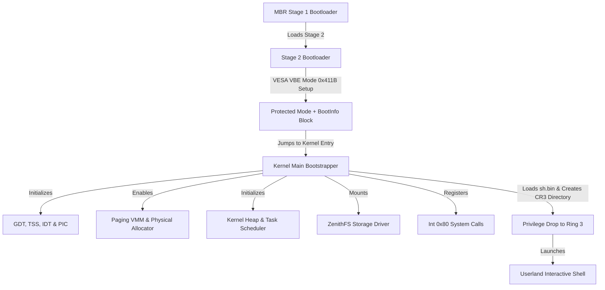

# Zenith OS

```text
 ZZZZZZ  EEEEEE  NN  NN  IIIIII  TTTTTT  HH  HH        OOOO    SSSS 
     ZZ  EE      NNN NN    II      TT    HH  HH       OO  OO  SS    
   ZZZ   EEEE    ######    II      TT    ######       OO  OO   SSSS 
  ZZ     EE      NN ###    II      TT    HH  HH       OO  OO      SS
 ZZZZZZ  EEEEEE  NN  NN  IIIIII    TT    HH  HH        OOOO    SSSS 
```

**Zenith OS** is a lightweight, high-resolution 32-bit x86 hobby operating system designed with premium cyber-retro aesthetics, preemptive multitasking, a custom kernel heap allocator, user-space Ring privilege separation, strict memory sandboxing, stack canary protection, and customized Ring 3 userland processes.

---

## Architecture Overview

Zenith OS boots from a raw MBR floppy disk image, initializes the CPU, reconfigure hardware PIC chips, enables two-level page directories with process-level isolation, mounts a secondary hard disk formatted with a custom file system (**ZenithFS**), and drops privilege levels to transition execution into userland.



---

## Technical Deep Dive

### 1. Bootloader & Kernel Initialization Sequence
* **Stage 1 MBR Bootloader (`boot/stage1.asm`)**: Resides in the first 512-byte sector of the floppy image. Resets the disk controller, registers the boot drive number, reads the Stage 2 bootloader from Sector 2 onwards into RAM, and transfers execution.
* **Stage 2 Bootloader (`boot/stage2.asm`)**:
  * **A20 Gate**: Activates the A20 gate via the PS/2 keyboard controller to allow addressing beyond 1MB.
  * **VESA VBE Graphics Selection**: Queries BIOS VESA Extensions to get linear framebuffer data. Scans for mode `0x411B` (1280x1024 pixels, 24-bit True Color RGB). Sets the video mode and writes a custom `BootInfo` block to memory address `0x7000`.
  * **Protected Mode Entry**: Loads a temporary 32-bit Global Descriptor Table (GDT), sets the PE (Protection Enable) bit in the control register `CR0`, performs a far jump to clear the prefetch queue, and enters 32-bit Protected Mode.
  * **Kernel Loading**: Reads the compiled raw kernel binary from Sector 17 onwards into memory address `0x100000` (1MB mark) and jumps to its entry point.

### 2. Memory Management Architecture
* **Physical Memory Manager (PMM)**: Tracks physical RAM pages (4KB frames) using a simple allocation bitmap starting above the kernel boundaries (16MB mark) to prevent kernel space overrides.
* **Virtual Memory Manager (VMM) & Paging**:
  * Employs two-level page directories (`PageDirectory` containing 1024 `PageTable` entries).
  * The master kernel page directory identity-maps the first 128MB of physical RAM to maintain consistent access to hardware, MMIO, and kernel structures.
* **Private Directory Separation (CR3 Isolation)**:
  * To implement process isolation, every spawned process is allocated its own private page directory via `vmm_create_page_dir()`, copying global kernel space mappings.
  * User-accessible application code is mapped starting at virtual boundary `0x40000000` up to `0x48000000` (128MB limit).
  * During process swaps, the scheduler reloads the CPU `CR3` register with the task's private directory address, isolating user tasks from each other and shielding Ring 0 kernel pages.
* **Kernel Heap Allocator (`kernel/heap.c`)**: Provides dynamic kernel memory allocation capabilities (similar to `malloc` and `free`). It manages memory pools in kernel space to track dynamically allocated structures (such as `Task` nodes).

### 3. Preemptive Task Scheduler & Context Switching
* **Preemptive Round-Robin Engine**: Driven by the Programmable Interval Timer (PIT) calibrated to 100Hz (10ms ticks). When a timer interrupt fires, the handler calls `scheduler_tick()`. If a task's runtime slice expires, it invokes `scheduler_yield()`.
* **Task State Machine**: Coordinates tasks across four primary states:
  * `TASK_READY`: Queued and waiting for CPU execution time.
  * `TASK_RUNNING`: Currently occupying the processor.
  * `TASK_SLEEPING`: Blocked for a specific interval, with `sleep_ticks` decremented at each scheduler heartbeat.
  * `TASK_DEAD`: Terminated and pending garbage collection.
* **Context Switching Mechanics**: Saves register states onto the current task's stack (EDI, ESI, EBP, ESP, EBX, EDX, ECX, EAX). The CPU pushes interrupt stack frames (EIP, CS, EFLAGS, ESP, SS). The scheduler switches ESP to the next ready task, swaps the virtual memory directory using the `CR3` register, and returns to execution using `iret`.
* **Kernel Heartbeat Thread**: Spawns a background kernel task that prints periodic diagnostic heartbeat logs to the COM1 serial interface.

### 4. Interrupt Handling & GDT/IDT
* **Global Descriptor Table (GDT) & Task State Segment (TSS)**:
  * Registers five main descriptors: Null Descriptor, Kernel Code (`0x08`), Kernel Data (`0x10`), User Code (`0x1B` with RPL 3 privilege), and User Data (`0x23` with RPL 3 privilege).
  * A custom TSS descriptor (`0x28`) is configured with the kernel stack bottom (`0x90000`). When a software interrupt or hardware exception occurs in Ring 3, the CPU automatically reads the TSS to restore the Ring 0 stack pointer, preventing user stack pollution.
* **Interrupt Descriptor Table (IDT) & PIC Remapping**:
  * Remaps the dual Intel 8259 PIC controllers (Master PIC IRQ 0-7 remapped to interrupts 32-39, Slave PIC IRQ 8-15 to interrupts 40-47) to avoid overlaps with Intel-reserved CPU exception vectors (0-31).
  * Configures 256 interrupt gates routing CPU exceptions (such as Double Faults and Page Faults), hardware interrupts (timer and keyboard), and software system calls (`int 0x80`).

### 5. High-Resolution Anti-Aliased Graphics Engine
* **Bilinear Character Upscaling**: Upscales standard 8x8 font bitmaps to a high-density 12x24 pixel grid. Instead of blocky scaling, a custom bilinear interpolation algorithm calculates fractional weights and blends character edges with the active background, producing smooth, anti-aliased retro-futuristic text.
* **Geometry Rasterization Engine**: Custom algorithms for drawing pixels, lines, circles, filled circles, rounded rectangles, and rounded rectangles with outlines.
* **Desktop Styling**: Paints a multi-toned cosmic gradient background (dark indigo to cosmic violet). Windows and the console card utilize layered drop shadows (`0x030305`, `0x050508`, `0x08080C`) and a carbon-black workspace surrounded by Cyber Cyan borders.
* **Power Management Interfaces**:
  * **ACPI Shutdown**: Writes QEMU-specific power-off parameters to emulator I/O ports (`0x604`, `0xB004`, `0x4004`) to cleanly shut down virtual machines.
  * **PS/2 Reset**: Writes command byte `0xFE` to the keyboard controller port `0x64` to trigger a CPU system reboot.

### 6. Storage & Custom ZenithFS Filesystem
* **ATA Hard Disk Driver**: Communicates with the primary IDE controller using low-level I/O port polling commands to read and write sectors.
* **ZenithFS Structure**: A custom flat filesystem formatting raw hard disk images. Uses single-indirect addressing block tables mapping disk sectors, enabling compiled user binaries up to 70KB to be read and executed. Includes a Python compiler utility `zfs_tool.py` to compile files, list directories, and package binary disk images.

### 7. Ring 3 Privilege Isolation & Security Sandboxing
* **Privilege Drop**: The kernel drops privileges to transition from Supervisor Ring 0 to User Ring 3. It structures the assembly stack to mimic an interrupt state, pushes user segment registers (`0x23` for DS/SS, `0x1B` for CS), pushes the instruction pointer (`0x40000000`), and executes `iret`.
* **CR3 Paging Isolation**: Prevents unauthorized page overrides. Users cannot map memory outside the designated user zone (`0x40000000` - `0x48000000`). Attempting to read or write kernel space triggers a hardware Page Fault (`#PF`, Exception 14) and terminates the task.
* **Syscall Verification**: System calls verify user-provided pointer arguments via `syscall_verify_pointer()` before reading or writing data.
* **TOCTOU Protection**: User space string parameters (like filenames) are copied character-by-character into local kernel buffers immediately upon system call entry, preventing Time-of-Check to Time-of-Use double-fetch memory attacks.
* **Stack Smashing Protections (Canaries)**: The OS compiles userland and kernel space targets with `-fstack-protector-all`. The stack canary (`__stack_chk_guard`) is initialized early in the boot sequence using entropy from the CPU timestamp counter (TSC via `rdtsc`). Detection of an overflow triggers `__stack_chk_fail`, printing a security alert and halting the CPU.
* **Zeroed User Stacks**: Allocates a 32KB stack (`0x400F8000` to `0x40100000`) per process, which is zeroed out at startup to prevent information leaks from dirty memory pages.
* **Privilege Level Drops**: User applications execute under user UID 1000. Privilege levels are checked upon executing critical calls such as `SYS_SHUTDOWN` and `SYS_REBOOT`, restricting these calls to root tasks (UID 0).

---

## System Calls (Int 0x80)

Zenith OS exposes a software interrupt interface via vector `0x80`. Registers `EAX` specifies the syscall number, while parameters are passed via `EBX`, `ECX`, and `EDX`.

| System Call | EAX | EBX | ECX | EDX | Return (EAX) | Description |
| :--- | :--- | :--- | :--- | :--- | :--- | :--- |
| `SYS_WRITE` | `0` | `const char* str` | - | - | `0` on success, `-1` on error | Prints a null-terminated string to the console with pointer validation. |
| `SYS_READ` | `1` | `char* buffer` | `uint32_t max_len` | - | Character count, `-1` on error | Reads a line from the keyboard buffer with inline editing support. |
| `SYS_SLEEP` | `2` | `uint32_t ticks` | - | - | `0` | Suspends execution of the task for a specified duration in clock ticks. |
| `SYS_EXIT` | `3` | - | - | - | `0` | Terminates the current process and halts its thread of execution. |
| `SYS_SET_COLOR` | `4` | `uint32_t fg` | `uint32_t bg` | - | `0` | Configures the default foreground and background text colors. |
| `SYS_LIST_FILES` | `5` | - | - | - | `0` | Outputs the ZenithFS root directory contents. |
| `SYS_EXEC` | `6` | `const char* filename` | - | - | `0` on success, `-1` on error | Loads a binary from disk, initializes a page directory, and drops to Ring 3. |
| `SYS_READ_FILE` | `7` | `const char* name` | `uint8_t* buffer` | - | File size, `-1` on error | Reads a file from ZenithFS into a validated user-space buffer. |
| `SYS_CLEAR` | `8` | - | - | - | `0` | Clears the console workspace screen area. |
| `SYS_GETCHAR` | `9` | `uint32_t non_blocking` | - | - | Key char, or `0` if empty | Reads a single character from the keyboard queue (blocking or non-blocking). |
| `SYS_SET_CURSOR` | `10` | `uint32_t col` | `uint32_t row` | - | `0` | Repositions the console cursor within the grid layout boundary. |
| `SYS_UPTIME` | `11` | - | - | - | Tick count | Returns the total system timer ticks elapsed since kernel boot. |
| `SYS_SHUTDOWN` | `12` | - | - | - | `0` on success, `-1` on error | Powers off the system using QEMU ACPI (UID 0 required). |
| `SYS_REBOOT` | `13` | - | - | - | `0` on success, `-1` on error | Restarts the machine via the PS/2 keyboard controller (UID 0 required). |

---

## Userland Applications

Zenith OS compiles userland binaries to separate flat binaries loaded from the custom disk filesystem:

### 1. Interactive Shell (`sh.bin`)
An interactive CLI shell exposing operating system configurations, system actions, and styling schemes.
* **Commands**:
  * `ls`: Lists ZenithFS root files and sizes.
  * `cat <file>`: Displays file contents (e.g., `cat hello.txt`).
  * `clear`: Clears the console workspace.
  * `calc`: Launches the algebraic calculator binary.
  * `blaster`: Launches the space shooter arcade game.
  * `exploit`: Launches the security verification suite.
  * `theme <name>`: Changes terminal colors. Themes: `default`, `matrix`, `retro`, `ocean`.
  * `shutdown`: Safe ACPI shutdown (requires root privilege).
  * `restart`: Safe hardware reboot (requires root privilege).

### 2. Freestanding Calculator (`calc.bin`)
An algebraic expression parser built using the Shunting-Yard algorithm.
* Parses operator precedence (`+`, `-`, `*`, `/`) and evaluates expressions.
* Handles nested parentheses and spacing inputs.
* Returns precision decimal calculations.

### 3. Space Shooter Arcade Game (`blaster.bin`)
A custom graphics-based space arcade game.
* **Game Mechanics**: Controls a space fighter on the bottom of the console grid. Fires lasers at diving squads of alien invaders while dodging drop-bombs.
* **Features**: Live scores, high score logging, interactive controls, and animations using bilinear scaled font sprites.
* **Controls**: `A` (Move Left), `D` (Move Right), `Space` (Fire Laser), `Q` (Quit Game).

### 4. Exploit Verification Suite (`exploit.bin`)
A test suite designed to verify operating system sandboxing integrity.
* **Verification Vectors**:
  1. *Syscall Kernel Pointer Leak*: Attempts to pass a kernel address (`0x100000`) to `SYS_WRITE`. System verifies pointers and rejects the call, printing a warning.
  2. *Direct Kernel Memory Read*: Tries to read from kernel virtual memory address `0x100000` directly. The MMU triggers a Page Fault (`#PF`), terminates the task, and returns safely to the shell.
  3. *User Stack Canary Smashing*: Intentionally overflows a local stack buffer in userland. The compiler-inserted stack canary detects modification, invokes `__stack_chk_fail`, outputs a security panic message, and halts the CPU to prevent code execution.

---

## Project Structure

```text
ZenithOS/
├── Makefile              # Master Makefile compiling bootloaders, kernel, and user apps
├── zfs_tool.py           # Python utility to format and package ZenithFS disk images
├── assets/               # Image assets and screenshots for README
├── boot/
│   ├── stage1.asm        # Sector 1 MBR bootloader
│   ├── stage2.asm        # VESA VBE configuration and PE switch
│   └── linker.ld         # Kernel memory linking script
├── kernel/
│   ├── kernel.c          # Core kernel bootstrap, GDT/IDT, scheduler, and process loader
│   ├── graphics.c/h      # VESA graphics drawing engine and bilinear text renderer
│   ├── paging.c/h        # Physical and Virtual memory managers
│   ├── task.c/h          # Task context scheduling, scheduler queues, and yielding
│   ├── heap.c/h          # Kernel dynamic memory heap allocator
│   ├── syscall.c/h       # Int 0x80 dispatching, parameter checking, and execution
│   ├── zenithfs.c/h      # ATA driver and custom file system parser
│   ├── gdt.c/h           # Segmentation setup
│   ├── idt.c/h           # Interrupt table setup
│   ├── interrupts.asm    # Common assembly interrupt routines
│   ├── timer.c/h         # Programmable Interval Timer (100Hz ticks)
│   └── keyboard.c/h      # PS/2 keyboard layout driver
└── user/
    ├── crt0.asm          # Execution entry stub for user applications
    ├── libc.c/h          # Syscall wraps (print, clear, sleep, exec, etc.)
    ├── linker.ld         # User application memory linking script
    ├── sh.c              # CLI terminal shell program
    ├── calc.c            # Calculator program
    ├── blaster.c         # Arcade shooter game program
    └── exploit.c         # Security verification suite program
```

---

## Disk Layout

When running `make`, the build system creates two distinct drive files:

### 1. Bootable Floppy Image (`build/zenithboot.img`)
A standard 1.44MB floppy disk image structured sector-by-sector:
* **Sector 1 (LBA 0)**: Stage 1 MBR Bootloader.
* **Sector 2-16 (LBA 1-15)**: Stage 2 Bootloader loader code.
* **Sector 17-250+ (LBA 16+)**: Core Kernel raw binary.

### 2. Primary Hard Disk Drive Image (`build/zenithos.zfs`)
A hard disk drive formatted with a flat directory structure and files populated using `zfs_tool.py`:
* Maps directories to single-indirect lookup blocks.
* Stores user executables: `sh.bin`, `hello.bin`, `calc.bin`, `blaster.bin`, `exploit.bin`.
* Stores configuration and text files (e.g., `hello.txt`).

---

## Build and Simulation

### Prerequisites
To compile and simulate Zenith OS locally, ensure your machine has the following tools installed:
* `nasm` (Netwide Assembler)
* `i686-elf-gcc` (Cross-compiler targeting x86 bare metal)
* `i686-elf-ld` (Cross-linker targeting x86 bare metal)
* `i686-elf-objcopy` (Binary converter)
* `qemu-system-i386` (QEMU x86 emulator)
* `python3` (Required for ZenithFS directory assembly tool)

### Building the Project
Clone the repository and run the Makefile targets:

```bash
# Clean previous build artifacts
make clean

# Compile bootloaders, kernel, user applications, ZenithFS, and boot inside QEMU
make run
```

### Serial Debugging
The core kernel writes initialization logs to the COM1 virtual serial port. In QEMU, this output is redirected to the terminal standard output (`-serial stdio`). You can inspect these logs during boot and execution to monitor scheduler events, system calls, GDT/IDT setups, and exploit detection events.
