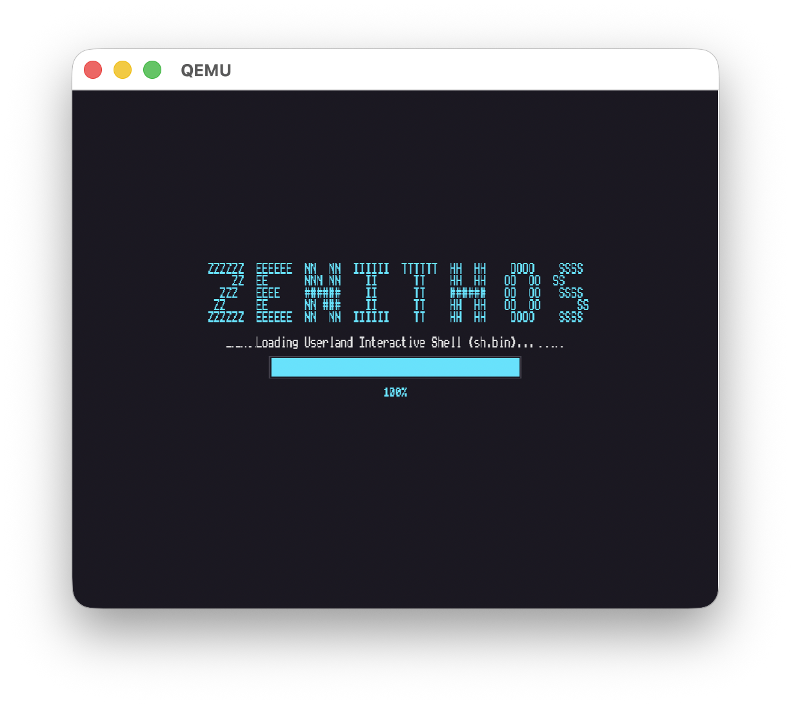
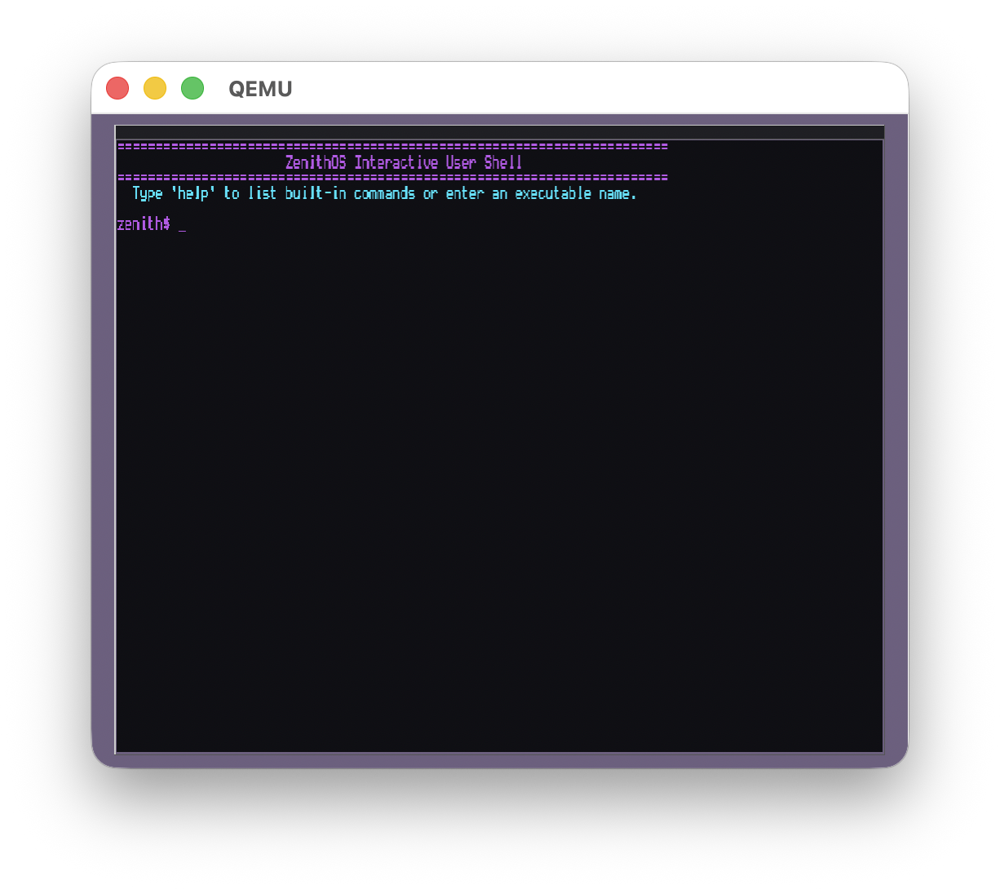

# Zenith OS

```text
 ZZZZZZ  EEEEEE  NN  NN  IIIIII  TTTTTT  HH  HH        OOOO    SSSS 
     ZZ  EE      NNN NN    II      TT    HH  HH       OO  OO  SS    
   ZZZ   EEEE    ######    II      TT    ######       OO  OO   SSSS 
  ZZ     EE      NN ###    II      TT    HH  HH       OO  OO      SS
 ZZZZZZ  EEEEEE  NN  NN  IIIIII    TT    HH  HH        OOOO    SSSS 
```

Zenith OS is a lightweight, high-resolution x86 hobby operating system designed with premium cyber-retro aesthetics, preemptive multitasking, a custom kernel heap allocator, user-space ring isolation, strict memory sandboxing, stack canary protection, and customized Ring 3 userland processes.

---

## Technical Architecture & System Features

### 1. Bootloader & Video Mode Setup
* **Two-Stage Boot**: `stage1.asm` sets up the sector reads and loads the main loader `stage2.asm`.
* **VESA VBE Linear Framebuffer**: Stage 2 queries and executes BIOS VESA mode `0x411B` setting the screen dimensions to **1280x1024** pixels with 24-bit RGB True Color.
* **Boot Info Block**: Key display attributes (framebuffer physical address, width, height, pitch, bpp) are written to memory address `0x7000` for the kernel to read during graphics initialization.

### 2. Kernel Core, Memory & Multitasking
* **Preemptive Task Scheduler**: Implements a preemptive Round-Robin task scheduler (`kernel/task.c`) running at 100Hz (driven by the PIT system timer) that manages process states (`READY`, `RUNNING`, `SLEEPING`, `DEAD`) and triggers context switching by saving and restoring CPU registers.
* **Kernel Heap Allocator**: Features a dedicated kernel heap memory manager (`kernel/heap.c`, `kernel/heap.h`) for dynamic kernel memory allocations.
* **Memory Paging**: A physical and virtual memory allocator identity-maps the first 128MB of RAM using a two-level page directory, protecting kernel structures and preventing unauthorized userland memory overrides.
* **Interrupt Routing**: Remaps PIC controllers and configures IDT gates to handle hardware interrupts (PIT timer, keyboard, and software syscalls).
* **PIT System Clock**: Programmable Interval Timer calibrated to 100Hz handles system ticks, scheduler task preemption, and sleep states.
* **Storage & File System**: The ATA controller reads sectors off the primary hard disk where a custom **ZenithFS** is formatted. ZenithFS supports single-indirect addressing allowing file maps up to 70KB in size to load separately compiled C binaries.

### 3. Graphics, Font Renderer & UI Design
* **Bilinear Text Interpolation**: Text is drawn by upscaling standard 8x8 font bitmaps to 12x24 screen pixels. A bilinear interpolation scaling algorithm blends pixel colors based on intensity, producing smooth, anti-aliased font rendering instead of standard blocky shapes.
* **Geometry Drawing Engine**: Features custom graphics drawing primitives including pixel drawing, lines, circles, filled circles, rounded rectangles, and rounded outline boxes.
* **Console Grid Layout**: Enforces a perfect **100x40 console grid** layout using workspace margins (`left/right/top/bottom = 48`). Scrolling routines copy pixel segments inside bounds, protecting the cosmic gradient background.
* **Cosmic Gradients & Drop Shadows**: Wallpaper is painted with a multi-toned cosmic gradient (dark indigo to violet). Desktop windows use layered drop shadows (`0x030305`, `0x050508`, `0x08080C`) and a carbon-base canvas bordered with Cyber Cyan.
* **Boot, Shutdown & Restart Overlays**:
  * Displays a centered visual progress bar and loading text status during boot stages.
  * Styled shutdown and reboot warnings are drawn centered on screen with drop shadows, warning red/cyber cyan outlines, and perform automatic power-off (via QEMU ACPI ports) or processor soft resets.

### 4. Ring Separation & Security Sandboxing
* **Ring 3 User Mode Privilege Separation**: Establishes strict isolation between Supervisor Ring 0 (kernel space) and User Ring 3 (user programs). The kernel triggers privilege dropping during task execution.
* **CR3 Page Directory Isolation**: Every user process runs in its own private page directory context. User memory space is limited to virtual boundaries `0x40000000` to `0x48000000` (up to 128MB), completely protecting the kernel address space.
* **Dynamic User Stack Mapping**: Mappings from `0x400F8000` to `0x40100000` (32KB stack) are allocated per process and zeroed out on initialization to prevent memory disclosure vulnerabilities.
* **Syscall Sanitization & TOCTOU Prevention**:
  * Registers soft interrupt `int 0x80` to bridge user-to-kernel operations.
  * Pointers provided by user-space are strictly verified (`syscall_verify_pointer`) to ensure they reside within the user-space boundary before reading/writing memory.
  * String arguments (like filenames for `SYS_EXEC` or `SYS_READ_FILE`) are copied character-by-character into kernel buffers immediately upon entry to prevent Time-of-Check to Time-of-Use (TOCTOU) double-fetch attacks.
* **Stack Smashing Protections (Canaries)**: Compiles all targets with `-fstack-protector-all`. The stack guard (`__stack_chk_guard`) is initialized using high-entropy CPU timestamp counter (TSC `rdtsc`) bits early at kernel boot. Stack corruption triggers a `__stack_chk_fail` kernel panic and halts the processor.
* **Privilege Levels**: Dropping process privileges to user UID 1000 blocks critical system interrupts and syscalls like reboot/shutdown.

### 5. System Calls Interface (Int 0x80)
Exposes 14 low-level routines to userland:
* `SYS_WRITE (0)`: Prints strings to the graphic console workspace with pointer verification.
* `SYS_READ (1)`: Reads keyboard lines with inline editor and echo.
* `SYS_SLEEP (2)`: Suspends execution for specified clock ticks.
* `SYS_EXIT (3)`: Terminates userland execution loops.
* `SYS_SET_COLOR (4)`: Sets the current console theme colors.
* `SYS_LIST_FILES (5)`: Queries ZenithFS directory listings.
* `SYS_EXEC (6)`: Replaces process memory and executes binaries from the disk.
* `SYS_READ_FILE (7)`: Opens and reads disk files.
* `SYS_CLEAR (8)`: Clears the console workspace.
* `SYS_GETCHAR (9)`: Reads character inputs (blocking/non-blocking).
* `SYS_SET_CURSOR (10)`: Moves the cursor column/row coordinates.
* `SYS_UPTIME (11)`: Retrieves elapsed PIT timer tick count.
* `SYS_SHUTDOWN (12)`: Triggers ACPI warning state and powers off QEMU (UID 0 privilege required).
* `SYS_REBOOT (13)`: Triggers restart warning state and reboots the CPU (UID 0 privilege required).

---

## Userland Applications & Shell

Zenith OS compiles userland binaries to separate flat binaries loaded from the custom disk filesystem:

* **Interactive Shell (`sh.bin`)**: Includes custom themes (`matrix`, `retro`, `ocean`, `default`), directory traversal (`ls`), file inspection (`cat`), calculator launching (`calc`), exploit suite (`exploit`), arcade gameplay (`blaster`), system reboot (`restart`), and system power-off (`shutdown`).
* **freestanding Calculator (`calc.bin`)**: An algebraic calculator parser supporting decimal operations, nested parentheses, and operator precedence order.
* **Retro Arcade Game (`blaster.bin`)**: Spawns an arcade-style space shooter where users dodge bombs, shoot lasers at diving alien squads, and track their high scores.
* **Exploit Verification Suite (`exploit.bin`)**: Interactive security suite verifying pointer verification, direct kernel space memory read page faults, and user-space stack canary smashing.

---

## Screenshots

### 1. Splash Boot Screen


### 2. Interactive Terminal Shell


---

## Build and Run

### Prerequisites
Make sure you have `nasm`, `i686-elf-gcc`, `i686-elf-ld`, `i686-elf-objcopy`, `qemu-system-i386`, and `python3` installed.

### Commands
```bash
# Clean previous build artifacts
make clean

# Build and execute inside QEMU
make run
```

