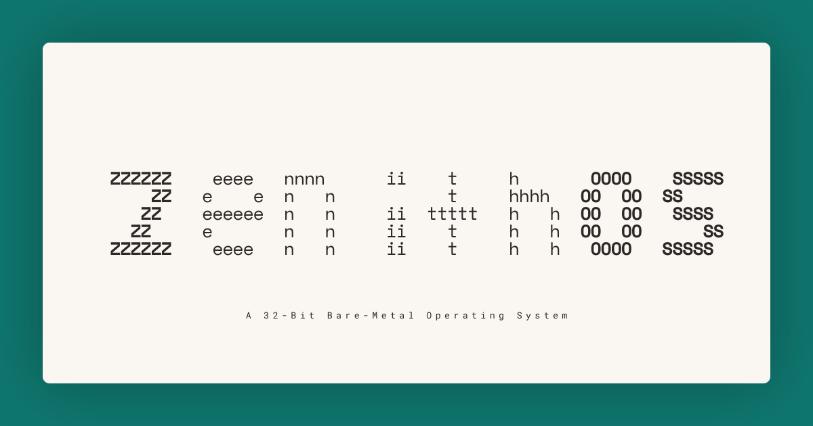
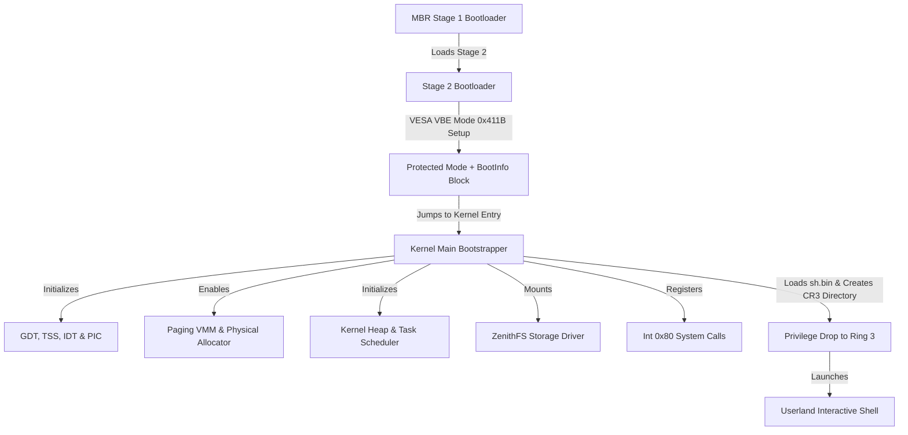
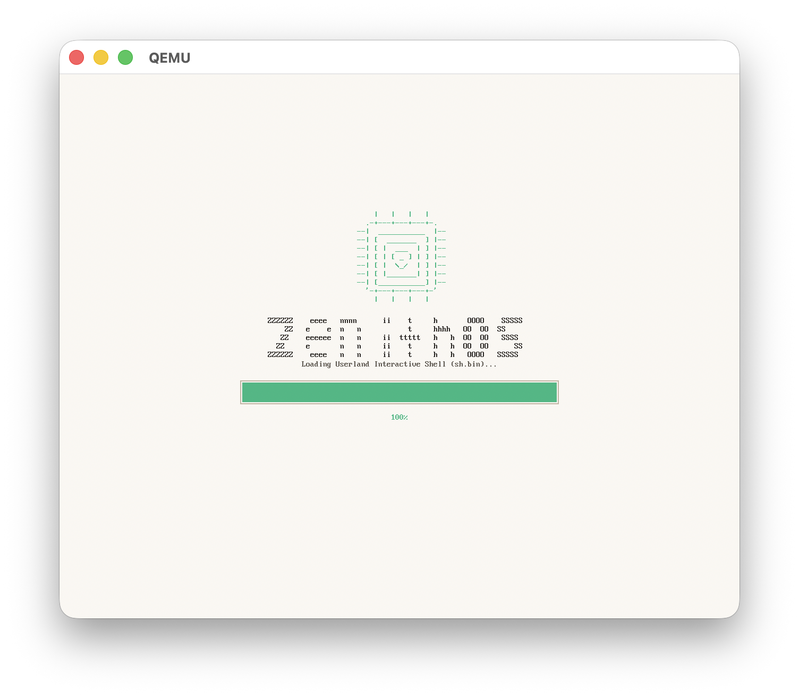
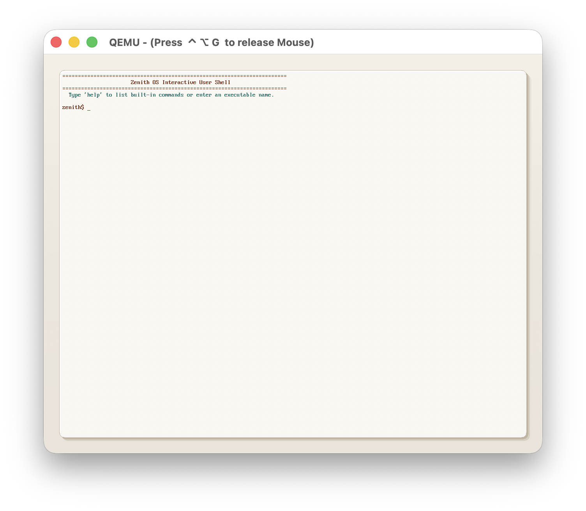
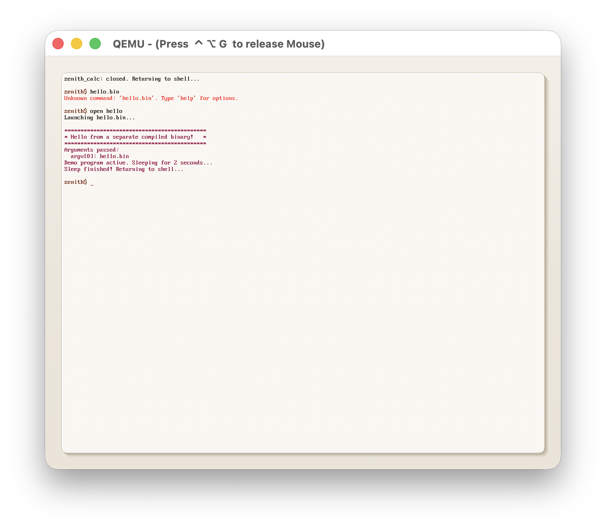
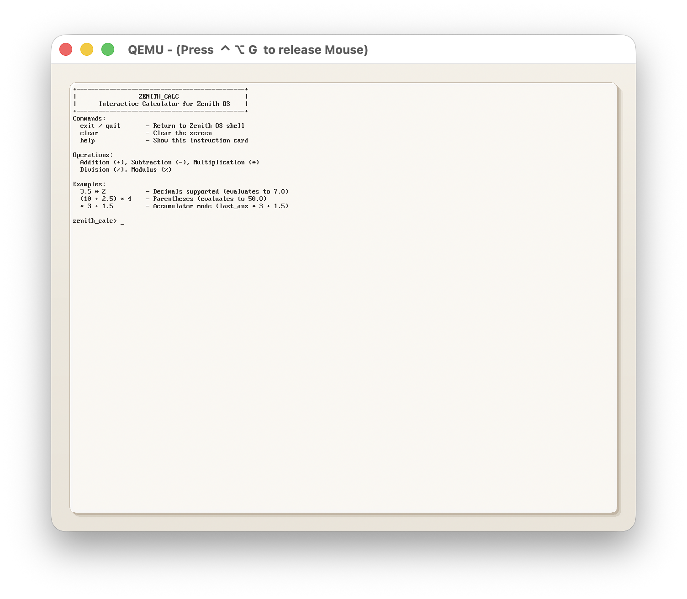
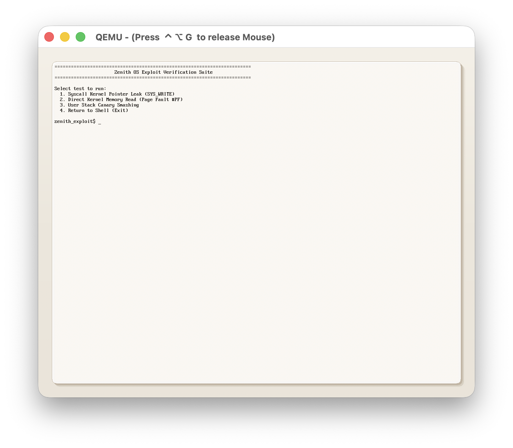
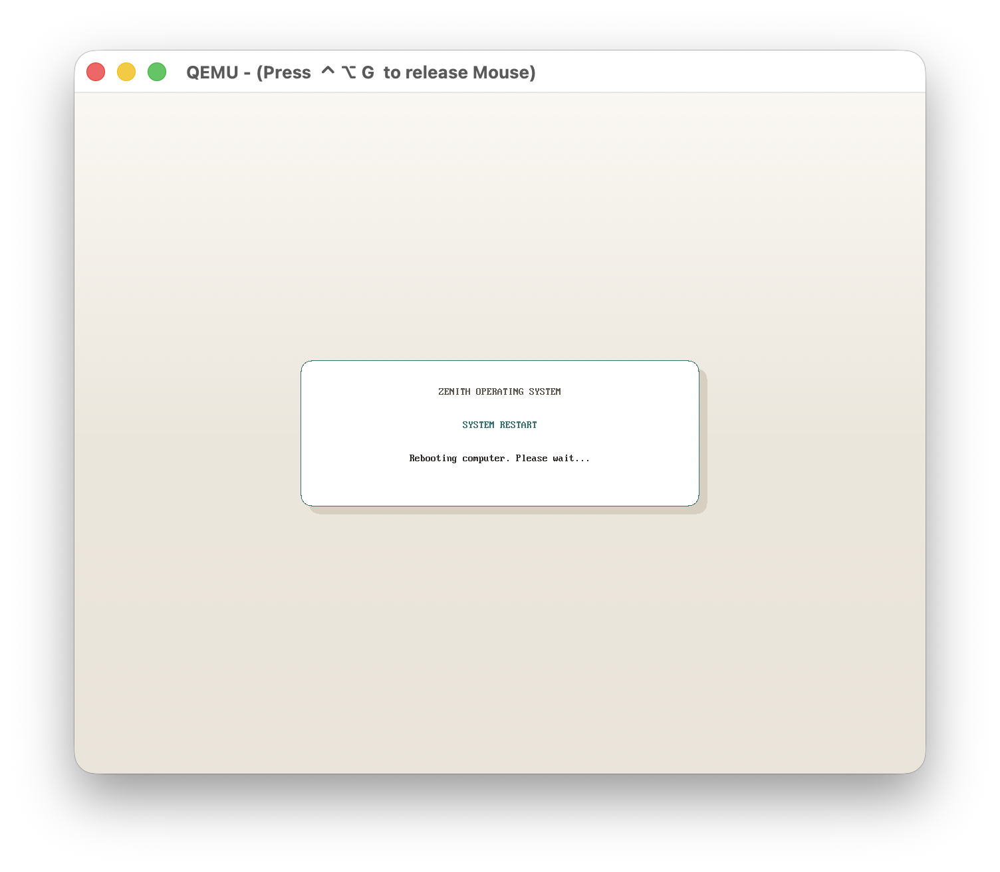
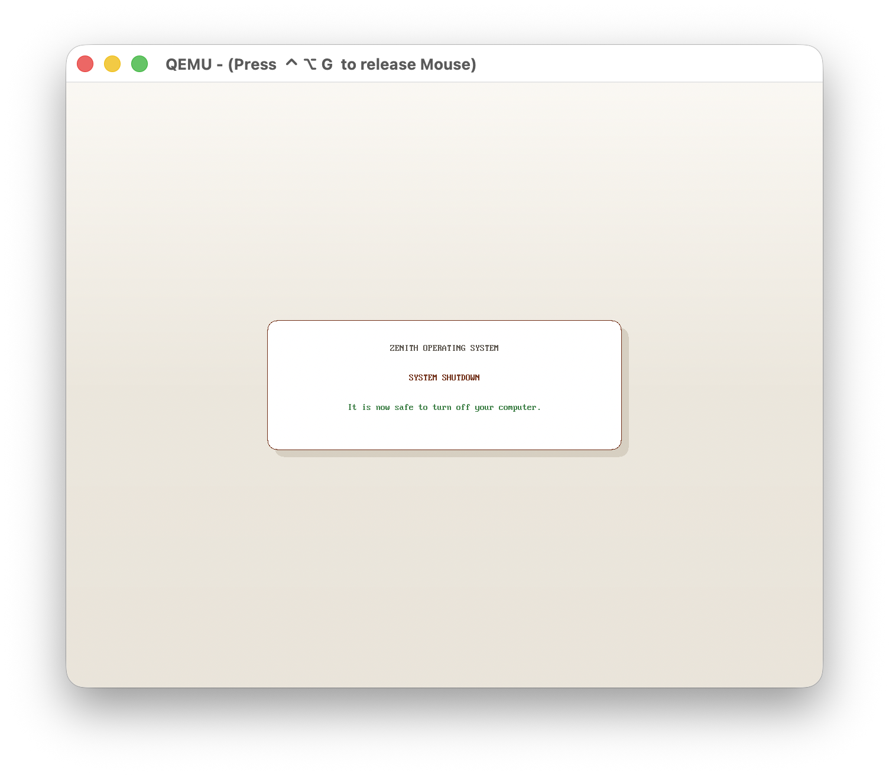

# Zenith OS



**Zenith OS** is a lightweight, bare-metal 32-bit x86 hobby operating system designed with a focus on modern aesthetic styling, preemptive multi-tasking, memory sandboxing, and security architecture. 

Featuring a cozy warm-beige light theme, bilinear anti-aliased font scaling, and a multi-process windowing compositor, Zenith OS demonstrates key concepts in operating system design, kernel development, and security modeling on vintage hardware architectures.

---

## Key Highlights

* **Cozy Light-Spectrum Aesthetics**: A beautiful warm-beige and parchment interface complete with soft drop-shadowed card layouts and forest green, deep teal, and terracotta accents.
* **Bilinear Font Scaler**: Custom real-time bilinear scaling engine that takes an 8x16 VGA font and scales it smoothly (16x32 grid) to eliminate pixelation and jagged edges.
* **Privilege & Memory Sandboxing**: Complete virtual memory isolation (Ring 0 vs Ring 3 separation) with hardware page tables (`CR3` swapping), preventing processes from accessing kernel or peer process spaces.
* **Stack Smashing Protection**: Early hardware-seeded stack canaries (`__stack_chk_guard`) generated using CPU timestamp counters (`rdtsc`) to guard against buffer overflows.
* **VFS & ZenithFS**: Virtual File System abstraction with file descriptor mapping (`open`, `close`, `read`, `write`) mounting standard IO (`/dev/keyboard`, `/dev/console`) alongside a custom hard disk driver.

---

## System Architecture



---

## Technical Deep Dive

### 1. Bootloader & Kernel Bootstrap
* **Stage 1 MBR ([boot/stage1.asm](file:///boot/stage1.asm))**: Initiates from floppy sector 1. Resets the disk controller, registers active drive numbers, loads Stage 2 into RAM, and hands over execution.
* **Stage 2 Loader ([boot/stage2.asm](file:///boot/stage2.asm))**:
  * **A20 Gate**: Activates A20 address routing via keyboard controller registers.
  * **VESA VBE Mode**: Configures Mode `0x411B` (1280x1024 pixel grid, 24-bit True Color RGB linear framebuffer) and writes parameters to memory block `0x7000`.
  * **Switch to Protected Mode**: Loads GDT descriptor registers, enables the PE bit in `CR0`, performs a far jump, and enters 32-bit Protected Mode.
  * **Kernel Load**: Copies the raw kernel executable into physical address `0x100000` (1MB mark) and jumps to its entry code.

### 2. Memory Isolation & Sandboxing
* **Physical Memory Allocator**: Manages physical pages (4KB blocks) via a bitmap allocator positioned safely above the kernel limits (16MB mark).
* **Virtual Memory Manager (VMM)**: Maps two-level page directories (`CR3`). Identity maps the lower 128MB for Ring 0 kernel hardware access.
* **Process Address Isolation**: Spawns unique, separate page directories for user tasks. Mapped ranges for applications sit strictly between `0x40000000` and `0x48000000`.
* **Privilege Level Drop**: Seeds the kernel stack to mimic a hardware interrupt frame, pushing user segments (`0x23` for DS/SS, `0x1B` for CS), setting the program entry point (`0x40000000`), and dropping to Ring 3 via an `iret` call.

### 3. Preemptive Scheduling & Task Switching
* **Preemptive Core**: Timer-driven round-robin scheduling via the PIT calibrated to 100Hz (10ms slices).
* **Context Saver**: Halts running tasks, pushes CPU registers (EDI, ESI, EBP, ESP, EBX, EDX, ECX, EAX) onto the task stack, switches the target stack pointer, reloads the virtual directory into `CR3`, and runs `iret`.
* **Heartbeat Logger**: Runs a background system thread printing periodic diagnostic heartbeats to the virtual COM1 serial interface.

### 4. Interrupts & System Calls
* **Descriptor Tables (GDT/IDT)**: Registers code and data segments alongside a custom TSS descriptor (`0x28`) pointing to the base Ring 0 stack (`0x90000`). This ensures a safe kernel stack switch whenever Ring 3 makes a system call.
* **PIC Remapping**: Maps PIC interrupts (IRQs 0-15) to vectors 32-47 to prevent interference with CPU exceptions.
* **Software Interrupts (`int 0x80`)**: User-to-kernel boundary handler that validates pointers (`syscall_verify_pointer()`) and performs fast string sanitization to guard against TOCTOU double-fetch vulnerabilities.

---

## System Calls (Int 0x80)

Zenith OS exposes its system services through vector `0x80`, passing the service ID in register `EAX` and arguments in `EBX`, `ECX`, and `EDX`.

| Syscall ID (EAX) | Name | EBX | ECX | EDX | Description |
| :---: | :--- | :--- | :--- | :--- | :--- |
| **0** | `SYS_WRITE` | `const char* str` | - | - | Writes a null-terminated string to stdout (validated). |
| **1** | `SYS_READ` | `char* buffer` | `uint32_t max_len` | - | Reads a line from the PS/2 keyboard buffer. |
| **2** | `SYS_SLEEP` | `uint32_t ticks` | - | - | Suspends execution of the task for clock ticks. |
| **3** | `SYS_EXIT` | - | - | - | Terminates the current process thread safely. |
| **4** | `SYS_SET_COLOR`| `uint32_t fg` | `uint32_t bg` | - | Updates current terminal foreground/background. |
| **5** | `SYS_LIST_FILES`| - | - | - | Lists root entries of ZenithFS. |
| **6** | `SYS_EXEC` | `const char* filename`| - | - | Spawns a compiled binary, creates CR3 mapping, and drops to Ring 3. |
| **7** | `SYS_READ_FILE`| `const char* name`| `uint8_t* buffer` | - | Reads file contents from ZenithFS into a buffer. |
| **8** | `SYS_CLEAR` | - | - | - | Clears the console terminal container. |
| **9** | `SYS_GETCHAR` | `uint32_t non_block`| - | - | Fetches a single character from the input buffer. |
| **10**| `SYS_SET_CURSOR`| `uint32_t col` | `uint32_t row` | - | Positions the terminal cursor on the coordinate grid. |
| **11**| `SYS_UPTIME` | - | - | - | Fetches system ticks since booting. |
| **12**| `SYS_SHUTDOWN` | - | - | - | Triggers QEMU ACPI poweroff (UID 0 root only). |
| **13**| `SYS_REBOOT` | - | - | - | Triggers CPU system reset via 8042 (UID 0 root only). |

---

## Userland Applications

* **Interactive User Shell (`sh.c`)**: Features list directory (`ls`), print file (`cat`), process monitor (`ps`/`top`), clear terminal (`clear`), run apps (`open <app_name>`), color theme switching (`theme <default|matrix|retro|ocean>`), shutdown, and reboot.
* **Desktop Calculator (`calc.c`)**: An algebraic parser utilizing the Shunting-Yard expression evaluator supporting decimals, operator priority, nested parentheses, and accumulator memory.
* **Exploit Verification Suite (`exploit.c`)**: A debugger suite validating sandboxing and security features:
  1. *Syscall Kernel Pointer Leak*: Asserts pointer parameter checking by passing a Ring 0 address to `SYS_WRITE` (correctly blocked).
  2. *Direct Kernel Read*: Tries to read from `0x100000` (blocked by hardware page tables, causing a clean Task Termination).
  3. *Stack Canary Smashing*: Overflows a local buffer to verify TSC-seeded canaries (results in a controlled kernel security panic).
* **Hello Demo (`hello.c`)**: A simple separate binary showcasing process initialization, argument passing (`argc`/`argv`), and clean color rendering aligned to the workspace theme.

---

## Project Structure

```text
ZenithOS/
├── Makefile              # Master Makefile compiling bootloaders, kernel, and user apps
├── zfs_tool.py           # Python utility to format and package ZenithFS disk images
├── assets/               # System screenshots and image assets
├── boot/
│   ├── stage1.asm        # Sector 1 MBR bootloader
│   ├── stage2.asm        # VESA VBE configuration and PE switch
│   └── linker.ld         # Kernel memory linking script
├── kernel/
│   ├── kernel.c          # Core kernel bootstrap, GDT/IDT, scheduler, and process loader
│   ├── graphics.c/h      # VESA graphics drawing engine and bilinear text renderer
│   ├── paging.c/h        # Physical and Virtual memory managers
│   ├── task.c/h          # Task context scheduling, scheduler queues, and yielding
│   ├── heap.c/h          # Kernel dynamic memory heap allocator
│   ├── syscall.c/h       # Int 0x80 dispatching, parameter checking, and execution
│   ├── zenithfs.c/h      # ATA driver and custom file system parser
│   ├── gdt.c/h           # Segmentation setup
│   ├── idt.c/h           # Interrupt table setup
│   ├── interrupts.asm    # Common assembly interrupt routines
│   ├── timer.c/h         # Programmable Interval Timer (100Hz ticks)
│   ├── sound.c/h         # PC Speaker sound driver
│   ├── vfs.c/h           # Virtual File System layer
│   └── keyboard.c/h      # PS/2 keyboard layout driver
└── user/
    ├── crt0.asm          # Execution entry stub for user applications
    ├── libc.c/h          # Syscall wraps (print, clear, sleep, exec, etc.)
    ├── linker.ld         # User application memory linking script
    ├── sh.c              # CLI terminal shell program
    ├── calc.c            # Calculator program
    ├── hello.c           # Hello world demo program
    └── exploit.c         # Security verification suite program
```

---

## Disk Layout

The compilation targets output two primary disk images:

### 1. Bootable Floppy (`build/zenithboot.img`)
A standard 1.44MB floppy image populated sector-by-sector:
* **Sector 1 (LBA 0)**: Stage 1 MBR Bootloader.
* **Sector 2-16 (LBA 1-15)**: Stage 2 Loader and configuration code.
* **Sector 17+ (LBA 16+)**: Core Kernel binary.

### 2. Primary Hard Disk (`build/zenithos.zfs`)
An IDE hard disk formatted with ZenithFS containing userland binaries (`sh.bin`, `hello.bin`, `calc.bin`, `exploit.bin`) and configuration/data text files (`hello.txt`).

---

## Build and Simulation

### Prerequisites
To build and simulate ZenithOS, ensure you have the following toolchain packages installed:
* `nasm` (Netwide Assembler)
* `i686-elf-gcc` (Cross-compiler targeting bare metal x86)
* `i686-elf-ld` (Cross-linker)
* `i686-elf-objcopy` (Binary strip utility)
* `qemu-system-i386` (QEMU x86 PC emulator)
* `python3` (Required for formatting ZenithFS images)

### Executing the Build
To compile the entire system and launch it in QEMU:
```bash
# Clean previous build targets
make clean

# Compile the floppy image, format/package the hard disk, and launch QEMU
make run
```

### Serial Diagnostics
Diagnostic tracing (kernel heap allocations, scheduler yields, privilege switches, and system exceptions) is written directly to the COM1 serial interface. In QEMU, this output is piped straight into standard host terminal output (`-serial stdio`).

---

## Screenshots

### 1. Splash Boot Screen


### 2. Interactive User Shell


### 3. Compiled Hello Binary (Aligned Theme)


### 4. Desktop Calculator Application


### 5. Privilege Sandbox & Exploit Suite


### 6. System Restart Dialog


### 7. System Shutdown Dialog

